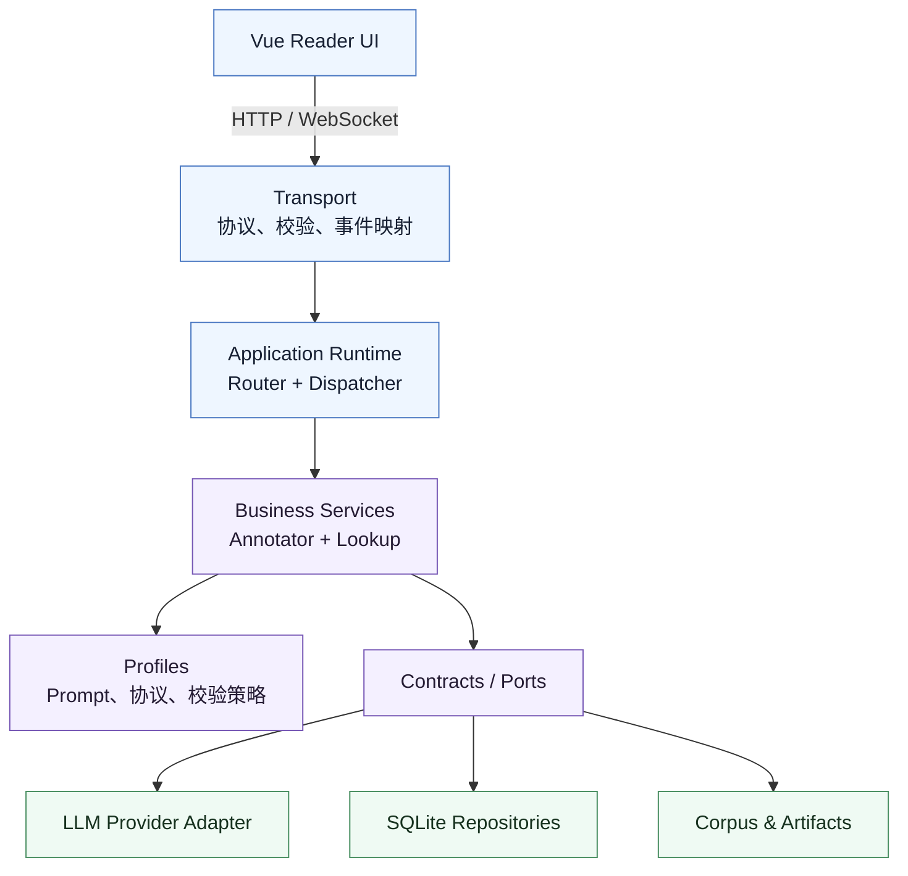

<div align="center">

# SuperHP Reading Agent

**一个确定性流程驱动、Profile 可扩展的 LLM 辅助精读系统**

[](https://github.com/Handao-dao/superHP-ReadingAgent/actions/workflows/ci.yml)


让 LLM 负责开放式内容生成，让可测试的应用代码掌握流程、权限与副作用。

</div>

SuperHP 面向英文小说精读，提供章节译注、点击查词、生词管理、阅读引导和书签恢复。它不把
大模型当作拥有无限工具权限的自主 Agent：Router 决定可选流程，Dispatcher 执行动作，LLM 只在
明确的业务边界内生成内容。

项目已持续用于真实阅读近一个月，完成 12 个章节的译注阅读并沉淀 400+ 生词；当前后端的
157 项测试分布在 25 个测试模块中，覆盖 Runtime、Provider、Service、Storage、WebSocket 与 API 等关键边界。

## 项目一览

| 关注点 | 设计 |
| --- | --- |
| Agent 控制 | Guided cards + Router/Dispatcher，不向模型开放任意流程和存储副作用 |
| Context 工程 | 组合稳定 system blocks、Profile 策略、用户熟词和当前正文 |
| 失败恢复 | Provider retry、输出校验、逐 chunk 原文回退和分类事件提示 |
| 扩展边界 | Profile、Provider、Repository 和前端 Renderer 可独立替换 |
| 工程验证 | 157 项后端测试 + Ruff + Pytest + Vue production build |

## 设计重点

- **流程确定，生成开放**：Flow Router 决定用户能看到哪些选择，Dispatcher 执行已选择的
  Action；LLM 生成内容，但不规划流程，也不直接操作存储。
- **策略与能力分离**：Service 定义“怎样完成译注”，Profile 定义“某类文本应该怎样译注”，
  Provider 定义“怎样调用模型”。三者可以独立演进。
- **依赖接口而非实现**：Runtime 和 Service 依赖 Ports；SQLite、模型 SDK、文件系统只是可替换的
  Adapter，由 Composition Root 统一装配。
- **失败被限制在最小边界**：单个 chunk 的 Provider 重试耗尽或内容校验失败，只回退该 chunk
  的原文，并向前端发送分类警告，不让整章阅读流程轻易中断。
- **不同数据拥有不同生命周期**：原文、译注产物、业务状态和诊断事件分别管理，不用一个万能
  StorageManager 模糊它们的职责。
- **前后端都保持单向数据流**：后端通过 Contracts 和 Events 交换信息；前端由 API、Composable、
  页面协调器、展示组件和 Profile Renderer 分层协作。

## 系统架构



图中最重要的是依赖方向：上层只表达自己需要的能力，具体 Provider、SQLite 和文件实现只在
`application/container.py` 中被选择并注入。业务代码不需要知道模型厂商、数据库连接方式或
WebSocket JSON 的细节。

`Application Bus` 已被保留为未来边界，但目前没有为了形式完整而实例化。只有当入口、Command
Handler 或事件订阅者明显增多时，Bus 才有足够价值；当前 Transport 直接连接 Router 和
Dispatcher，结构更清晰。

## 一次译注如何穿过系统

1. 前端从 guided card 发出一个标准 Action，而不是发送自由聊天指令。
2. WebSocket Transport 校验消息，Dispatcher 将 Action 交给对应 Handler。
3. Handler 读取 Corpus、已掌握词和系列配置，再调用 `AnnotatorService`。
4. Service 先按自然段组织文本，以约 `1000` 个粗略单位为单块上限，并以默认 `8` 路并发处理。
5. Context Builder 组合稳定 system blocks、当前熟词和 reader text；Profile 注入文本场景规则及
   可选的系列 selection policy。
6. Provider Adapter 调用模型并执行 retry；Service 校验标记格式，并通过还原左侧原文确认模型
   没有改写正文。
7. 某个 chunk 最终失败时，该块回退原文并产生 `provider` 或 `validation` 类事件；其他块继续。
8. Handler 保存可用译注副本和词汇，前端持续收到进度、降级提示与最终正文。

这条链路把模型的不确定性限制在 Service 内，把存储副作用集中在 Handler/Repository 边界，并让
每一步都能用独立测试替代真实模型或真实数据库。

## 可扩展性

### 加入普通英文小说

新增 Markdown 语料并在 `corpus/catalog.yaml` 中登记系列和图书即可复用完整英文阅读链路。
普通系列不需要额外 policy；只有确实存在稳定术语或特殊选词边界时，才增加可替换的
`selection_policy_id`。

### 加入新的文本场景

新增 Profile 来定义 Prompt、标记解析、结果校验、查词策略和 renderer hint，再新增对应的前端
Renderer。Router、Dispatcher、并发译注、Provider retry、chunk 降级和存储结构无需复制。

Profile 是迁移扩展点，不是要求所有文本场景对称实现的统一模板。新场景只需满足最小协议，不应
为了表面一致而削弱英文小说这一产品主路径。

### 替换模型供应商

实现 `LLMProvider` Port，或增加一个 OpenAI-compatible 配置。Service 只依赖厂商无关的请求与
响应 Contract，因此不需要改写译注业务流程。

### 替换持久化实现

实现对应 Repository Port，并在 Composition Root 中替换 SQLite Adapter。业务层表达的是
“读取已掌握词”“保存书签”等能力，而不是 SQL、表名或连接对象。

## 数据边界

| 数据 | 权威来源 | 说明 |
| --- | --- | --- |
| 小说原文与元数据 | `corpus/**/*.md` | 只读 Markdown + YAML frontmatter |
| 系列与图书顺序 | `corpus/catalog.yaml` | 可选地为特色系列绑定 selection policy |
| 译注正文 | `backend/data/annotated_corpus/` | 每个阅读单元一份 Artifact，带原文 hash 与校验状态 |
| 生词、掌握状态、书签、阅读进度 | `backend/data/superhp.sqlite3` | 书中词表按图书隔离；同语言掌握状态共享 |
| 行为与诊断事件 | `backend/data/memory/events.jsonl` | 只追加日志，不作为业务状态真相来源 |

这种拆分让原始语料可以版本管理，让生成产物可以重建，让查询型状态适合 SQLite，也让诊断日志
不反向参与业务决策。

## 前端分层

前端采用“API 边界 → 领域 Composable → 页面协调器 → 展示组件”的单向数据流：

```text
frontend/src/
├── api/             # HTTP 请求与错误转换，不持有 Vue 状态
├── composables/     # 目录、会话、分页、书签、查词等领域状态
├── components/      # props 向下、events 向上的展示组件
├── renderers/       # Profile-specific 正文解析与标记渲染
├── App.vue          # 只协调跨领域流程
└── styles.css       # 阅读壳与主题样式入口
```

可重复触发的异步读取使用 request revision，只有最新请求可以更新页面；查词关闭、章节切换或
Profile 切换后，迟到响应不会覆盖当前界面。Renderer 只负责文本转换，不获取数据、不保存生词，
也不控制分页导航。

## 当前能力

- 图书馆按 Profile → 系列 → 图书 → 章节组织本地语料。
- Guided cards 驱动阅读，不暴露自由聊天和无限工具调用。
- 英文小说译注以 B1–B2 读者为参考，每 300 词以约 8 处为参考，并可根据文本难度在最多 15 处内调整。
- 支持原文/译注阅读、纸面分页、键盘翻页、显式书签和位置恢复。
- 点击单词查词，可加入生词、补充手动标注或标记为已掌握。
- 生词表支持系列、图书、章节筛选；书内词表隔离，同语言掌握状态共享。
- Provider retry、模型输出校验、逐 chunk 原文回退和前端分类降级提示形成两层容错。
- 默认 Profile、Corpus Profile 和 selection policy 在启动阶段严格校验，拼写错误不会静默回退。
- 内置英文小说与文言文 Profile，共享运行时骨架但允许不同 Prompt、标记和 Renderer。

## 项目结构

```text
superHP-ReadingAgent/
├── backend/
│   ├── src/superhp_agent/
│   │   ├── application/    # Composition Root
│   │   ├── contracts/      # Action、Event、Reading、Annotation、LLM 数据契约
│   │   ├── domain/         # 无基础设施依赖的领域规则
│   │   ├── ports/          # Provider、Event、Repository 能力接口
│   │   ├── profiles/       # 文本场景策略与可选系列 policy
│   │   ├── runtime/        # Flow Router、Dispatcher、Cards、Read Model
│   │   ├── services/       # 译注与查词业务服务
│   │   ├── storage/        # SQLite Repository Adapters 与 migrations
│   │   └── transport/      # HTTP / WebSocket 协议边界
│   └── data/               # 本地运行数据，不属于源码架构层
├── frontend/               # Vue 3 + Vite 阅读界面
├── corpus/                 # 原始阅读语料与 library catalog
├── tools/corpus_pipeline/  # 离线 EPUB 提取与语料维护，不在应用运行主链路
└── start-dev.ps1           # 同时启动前后端的本地开发入口
```

## 快速开始

需要 Python 3.11+、[uv](https://docs.astral.sh/uv/) 和 Node.js。

```powershell
# 后端依赖与配置
cd backend
uv sync --locked --extra dev
Copy-Item .env.example .env
# 在 .env 中填写 LLM_API_KEY，并按需修改模型配置

# 前端依赖
cd ../frontend
npm ci

# 从项目根目录同时启动前后端
cd ..
.\start-dev.ps1
```

默认地址：

- 前端：`http://127.0.0.1:5173`
- 后端：`http://127.0.0.1:8000`
- API 文档：`http://127.0.0.1:8000/docs`

也可以分别启动：

```powershell
cd backend
uv run uvicorn superhp_agent.main:app --reload

cd frontend
npm run dev
```

## Corpus 格式

每个 Markdown 文件表示一个稳定的阅读单元：

```md
---
id: hp01-ch01
chapter_id: hp01-ch01
book_id: hp01
book_title: "Harry Potter and the Philosopher's Stone"
chapter_no: 1
chapter_title: "The Boy Who Lived"
summary: "Chapter summary."
profile_id: english_novel
---

Chapter body...
```

`profile_id` 未填写时使用后端默认 Profile。应用启动时会验证 Profile、重复 ID、目录配置和
selection policy；运行时只能通过 `unit_id` 读取 Corpus，不能让前端传入任意文件路径。

## 验证

每次 push 和 pull request 都会通过 [GitHub Actions](.github/workflows/ci.yml) 自动执行后端静态检查、
测试以及前端 production build。本地可运行同一组检查：

```powershell
cd backend
uv run ruff check src tests
uv run pytest

cd ../frontend
npm run build
```

## 深入阅读

- [后端整体实现](backend/BACKEND_OVERVIEW.md)
- [后端解耦分层与依赖规则](backend/src/superhp_agent/README.md)
- [Annotator Service、校验与降级](backend/src/superhp_agent/services/README.md)
- [Ports、Storage 与数据真相来源](backend/src/superhp_agent/storage/README.md)
- [前端集成协议](frontend/FRONTEND_INTEGRATION.md)
- [前端解耦分层](frontend/src/README.md)
- [Corpus 维护](corpus/README.md)
- [离线 EPUB 处理流程](tools/corpus_pipeline/README.md)

## 版权说明

小说原文和 EPUB 仅建议作为本地个人学习资料使用。公开仓库或分发版本中应谨慎处理受版权保护的
文本，并确保拥有相应的使用与传播权利。
