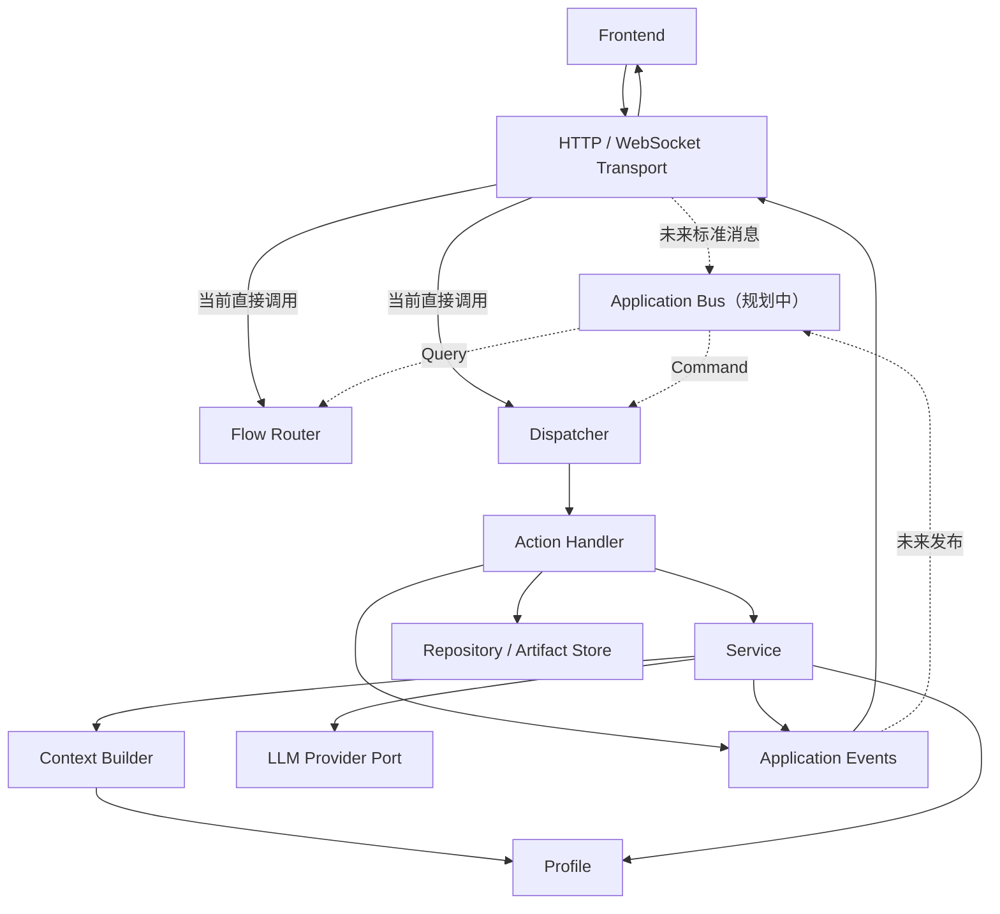

# 后端解耦分层与演进方向

本文面向维护 `superhp_agent` 源码的开发者，记录当前后端的职责边界、目标依赖方向和渐进重构顺序。已有功能、接口与模块细节见项目级 [`BACKEND_OVERVIEW.md`](../../BACKEND_OVERVIEW.md)；本文重点回答“代码应该属于哪一层”和“后续怎样重构而不破坏现有行为”。

## 当前定位

当前后端是一个确定性的 guided reading runtime，而不是自主循环式 Agent：

```text
接收前端消息
    → 读取阅读状态
    → Flow Router 生成 Cards
    → 用户选择 Action
    → Dispatcher 找到 Handler
    → Handler 调用 Service / Storage
    → 发出进度和结果事件
    → 重新生成 Cards
```

LLM 负责译注和查词，不负责自主规划下一步，也不直接取得无限工具执行权限。未来可以增加 Planner 或 Agent Loop，但不应破坏当前确定性、安全和可测试的 Action 边界。

## 核心设计原则

- Transport 处理协议，不承载业务决策。
- Bus 负责消息中转，不承载业务实现；目前只保留规划边界，暂不实例化。
- Flow Router 决定“展示什么选择”。
- Dispatcher 决定“把 Action 交给哪个 Handler”。
- Handler 决定“这项动作怎样完成”。
- Service 定义模型业务任务。
- Context Builder 只构造当前模型任务所需上下文。
- Profile 定义文本场景策略。
- Provider 封装模型 SDK、协议和重试。
- Contracts 定义模块之间交换的数据。
- Storage / Repository 定义数据如何读取和持久化。
- Composition Root 是唯一允许了解全部具体实现的地方。

## 术语与职责边界

### Transport Router

当前对应 `main.py` 中的 HTTP endpoints 和 `transport/reading_ws.py`。

负责：

- 接收 HTTP / WebSocket 请求。
- 校验 JSON 和 Pydantic DTO。
- 管理连接生命周期。
- 将 Transport DTO 转换为标准 Query / Command。
- 把后端 Event 转换为 HTTP response 或 WebSocket message。

不负责：

- 决定 Cards。
- 执行 Action。
- 调用 Provider。
- 访问文件和数据库完成业务动作。

### Application Bus（规划边界，暂不实例化）

Bus 是后端应用消息的统一入口和中转站。目标职责是：

- 将 Query 交给对应 Query Handler 或 Flow Router。
- 将 Command / Action 交给 Dispatcher。
- 将 Application Event 转交给 Transport、日志、审计或未来订阅者。
- 隔离 Transport 协议与应用层入口。

Bus 不负责：

- 根据阅读状态生成 Cards。
- 实现 Action Handler。
- 调用 LLM。
- 保存业务数据。
- 拼接 Prompt。

当前 `ReadingSocketSession` 暂时承担了一部分消息中转职责。只有当 Contracts 稳定、入口或事件消费者增多时，才考虑实现 Bus，避免先创建仅根据字符串做 `if/else` 的空壳。

### Flow Router

当前对应 `runtime/action_router.py` 中的 `ReadingFlowRouter`。

负责：

- 读取 `ReadingUnitState`。
- 根据 phase 和当前状态选择 Cards。
- 保持阅读流程确定性。

不负责：

- 接收 WebSocket。
- 执行 Card Action。
- 写入 Memory / DB。
- 调用模型。

### Dispatcher 与 Handler

当前位于 `runtime/action_dispatcher.py`。

Dispatcher 负责：

- 根据 Action ID 找到 Handler。
- 对未知 Action 返回统一错误。
- 调用 Handler。

Handler 负责：

- 校验本 Action 需要的 payload。
- 组合 Corpus、Service、Repository、Artifact Store 等能力。
- 更新应用状态。
- 发出 Application Event。

Dispatcher 本身不应继续承载译注文件路径、Markdown 序列化、API DTO 组装等具体职责。

### Service

当前对应 `services/annotator.py` 和 `services/lookup.py`。

Service 负责一个明确的后端业务能力，例如：

- 文本分块和并发译注。
- 模型结果合并、截断检测与解析。
- 上下文查词和 JSON 修复。

Service 可以依赖 Profile、Context 和 Provider Port，但不应依赖 FastAPI、WebSocket、具体 SQLite 实现或页面流程。

### Context Builder

当前由 `context.py`、Profile 的 context 构造方法和 `AnnotatorService` 共同实现。

负责：

- 将稳定规则组织为 system blocks。
- 将 Density、已掌握词等任务状态组织为运行时 blocks。
- 为每个 chunk 追加 reader text。
- 输出模型 messages。

模型 Context 不等于完整应用状态。书签、页面位置等与当前模型任务无关的数据不应进入 Context。

### Profile

当前位于 `profiles/`，通过 `ProfileRegistry` 注册。

Profile 是文本场景策略插件，负责：

- Prompt 和 Context policy。
- Annotation marker 解析。
- Lookup policy。
- POS / 学习标签规则。
- Card copy。
- 前端 renderer hint。

Profile 不负责调用 Provider、访问数据库、保存文件、发送 WebSocket 或执行 Action。

### Domain Rules

纯领域规则位于 `domain/`，可以同时被 Service 与 Infrastructure 使用，但不依赖两者。
当前 `domain/vocabulary.py` 负责合法词性集合、英文简写映射和未知词性回退；它不解析模型响应、
访问 SQLite 或构造 API DTO。`storage.normalize_pos` 暂时保留为兼容导出。

### Provider

具体实现位于 `providers/`；应用层接口位于 `ports/llm.py`，厂商无关响应位于
`contracts/llm.py`。

Provider 是模型基础设施适配器，负责：

- 封装厂商 SDK 或 OpenAI-compatible 协议。
- 统一模型请求和响应。
- 重试、错误归一化和 provider 元数据。

Provider 回答“怎样调用模型”；Service 回答“为了完成业务任务，模型应怎样被使用”。
Service 只依赖最小 `LLMProvider` Protocol。`BaseLLMProvider` 负责 generation 默认值和重试，
OpenAI-compatible Adapter 继承该实现基类；旧的 `providers.base.LLMProvider` 名称仅作为兼容别名。

### Contracts

Contracts 定义模块之间交换的数据，不负责保存数据或执行行为。目标上区分：

```text
contracts/
├── commands.py       # 请求系统执行某件事
├── queries.py        # 请求系统返回只读状态
├── events.py         # 已经发生的事实
├── http.py           # HTTP request / response DTO
└── websocket.py      # WebSocket 协议 DTO
```

语义约定：

- Command 使用祈使语义，例如 `GenerateAnnotation`。
- Query 使用读取语义，例如 `GetReadingCards`。
- Event 使用过去式语义，例如 `AnnotationCompleted`。
- Transport DTO 只描述边界 JSON，不应成为 Runtime 的内部模型。

当前 `schemas.py` 混合了部分 HTTP DTO、WebSocket payload 和应用模型。迁移时保留 `schemas.py` 作为兼容 re-export，逐步修改 import，避免一次破坏所有 API 和测试。

目前 `AgentAction` 已迁入 `contracts/actions.py`；`ReadingUnitMeta`、`ReadingUnitDetail` 和
`AgentCard` 已迁入 `contracts/reading.py`。Transport、Runtime 与 Composition Root 直接依赖
新 Contract，`schemas.py` 保留同名 re-export 和 `ChapterMeta` / `ChapterDetail` 旧命名别名。
`BackendEvent` 位于 `contracts/events.py`，事件输出能力由 `ports/events.py` 中的
`EventSink` 定义；`runtime/events.py` 仅保留适配器与旧导入兼容。

### State / Read Model

当前 `runtime/reading_state.py` 中的 `ReadingStateReader` 聚合：

- Corpus 中的阅读单元。
- Memory 中的已读和当前状态。
- DB 中的词汇统计。
- Annotated artifact 是否存在。

它通过 `artifacts/annotated_copies.py` 中的 `AnnotatedCopyStore` 查询译注产物，
是只读聚合器，不应写入进度、生成文件或反向依赖 Dispatcher。

### Storage / Repository / Artifact Store

数据按性质分为四类，不合并成一个万能 StorageManager：

```text
storage/
├── corpus.py              # 不可变原始 Markdown 语料
├── annotated_copies.py    # 模型生成的阅读产物
├── reading_memory.py      # 当前进度和轻量事件日志
├── database.py            # SQLite 连接和 migration
└── repositories/
    ├── units.py
    ├── vocabulary.py
    └── bookmarks.py
```

- `CorpusStore`：扫描、解析并安全读取原始语料。
- `AnnotatedCopyStore`：命名、兼容回退、读取和保存译注副本。
- `ReadingMemoryStore`：保存当前、已打开、已读、已译注状态和轻量事件日志。
- Repository：提供业务数据操作，不向上层暴露 SQL row 细节。

Runtime 当前通过 `ports/repositories/vocabulary.py` 中的最小 `VocabularyRepository` 使用
词汇能力；`AppDB` 以结构化方式实现该 Port。HTTP 端完整 CRUD 和 SQL 仍暂留在 `AppDB`，
等访问边界稳定后再移动实现。

当前先将 `AnnotatedCopyStore` 放在 `artifacts/`，强调它管理的是模型生成、可重建的阅读产物。
阶段 4 再结合其他存储模块的迁移结果，决定是否统一归入 `storage/` package；上层只依赖 Store
职责，不依赖它最终所在的目录布局。

Contract 回答“模块之间交换什么数据”；Repository 回答“数据如何保存和读取”。

### Composition Root

当前主要由 `main.py` 承担。目标上它负责：

- 读取 Settings。
- 创建 Stores、Repositories、Provider、Services、Profiles、Router 和 Dispatcher。
- 将具体实现注入 Transport。
- 创建 FastAPI app 并注册 routes。

其他模块不应反向导入 Composition Root 或依赖其中的全局单例。

## 当前消息流



## 目标依赖方向

允许的总体方向：

```text
Transport
    → Bus / Application Runtime
        → Domain Policies / Ports
            ← Infrastructure Implementations
```

具体规则：

- Transport 可以依赖 Contracts 和 Application 入口。
- Runtime 可以依赖 Domain、Service 和 Port Protocol。
- Service 可以依赖 Profile、Context 和 Provider/Event Port。
- Infrastructure 实现 Port，但业务层不应依赖具体基础设施类。
- Domain / Profile 不依赖 Transport、FastAPI、SQLite 或具体 Provider。
- Read Model 不依赖 Dispatcher。
- Service 不依赖 Storage 中的工具函数。

## 已知边界问题

已解决：

- `ReadingStateReader` 和 Action Handlers 现在共同依赖 `AnnotatedCopyStore`，已消除
  `ReadingStateReader → ActionDispatcher` 的反向依赖。
- `AnnotatorService` 现在依赖 `ports.events.EventSink`，已消除
  `AnnotatorService → runtime.events` 的反向依赖。
- `WordLookupService` 和 Storage 现在共同依赖 `domain.vocabulary.normalize_pos`，已消除
  `WordLookupService → storage` 的反向依赖。
- Action Handler、Read Model 与 WebSocket Session 现在依赖 `VocabularyRepository`，不再直接
  依赖具体 `AppDB`。

以下问题继续按渐进方式修复，不要求一次移动所有目录：

1. `action_dispatcher.py` 仍同时负责分发、Handlers 和 API DTO 组装，职责偏多。
2. `BackendEvent.as_message()` 暂时保留前端扁平 JSON 映射，Application Event 与 Transport Event DTO 尚未完全分开。
3. `main.py` 同时承担 Composition Root、全部 HTTP routes 和 DTO mapper。
4. `AppDB` 同时负责连接、migration、unit、vocabulary 和 bookmark。
5. `tools/` 当前未进入实际运行链，需要后续决定接入或归档。
6. `prompts.py` 已主要成为 English profile 的兼容包装层。

## 渐进重构路线

### 阶段 1：AnnotatedCopyStore（已完成）

- 新建独立译注副本存储模块。
- 移出路径解析、Legacy 回退、存在性判断、读取、写入和 Markdown 序列化。
- 让 `ReadingStateReader` 与 Action Handlers 同时依赖该 Store。
- 消除 `ReadingStateReader → ActionDispatcher`。

外部 API、WebSocket 事件和文件格式保持不变。

实现位于 `artifacts/annotated_copies.py`；Composition Root 创建同一个 Store，并注入
`ReadingStateReader`、WebSocket Session 和 Action Context。旧的目录参数仍作为兼容入口，便于现有测试和调用方渐进迁移。

### 阶段 2：最小 Contracts（进行中）

- 已完成第一刀：抽出 `contracts/actions.py` 中的 `AgentAction`。
- 已完成第二刀：抽出 `contracts/reading.py` 中的阅读单元和 Card 只读模型。
- 已完成第三刀：抽出 `contracts/events.py` 中的 `BackendEvent`。
- 已完成第四刀：抽出 `contracts/llm.py` 中厂商无关的 `LLMResponse`。
- 后续单独拆分 Transport Event DTO，不直接改变现有 WebSocket 消息。
- 保留 `schemas.py` 兼容 re-export。
- 逐步区分 Transport DTO、Command、Query 和 Event。
- 每次迁移一组 import，并运行全量测试。

### 阶段 3：通用 Ports（进行中）

- 已将 EventSink 移到 `ports/events.py`，Service 不再依赖 Runtime 事件模块。
- 已在 `ports/llm.py` 建立最小 LLMProvider Protocol，Service 不再依赖 Provider 实现包。
- 已将 POS 规范化提取为 Vocabulary Domain Rule，Service 不再依赖 Storage 工具函数。
- 已建立最小 VocabularyRepository Protocol，Action Handler、Read Model 与 WebSocket Session
  不再依赖具体 `AppDB`。
- 后续为 Bookmark Repository 建立独立 Port，不扩张 Vocabulary 接口。

### 阶段 4：Storage Package

- 已先稳定 Vocabulary Repository 的上层访问边界，SQLite 实现暂留 `AppDB`。
- 将 `storage.py` 转成 package。
- 先拆 Bookmark 与 Vocabulary Repository。
- 再拆 database connection 和 migrations。
- Corpus、Memory、Annotated Copy 保持不同的数据生命周期。

### 阶段 5：Composition Root 与 HTTP Routers

- 新建 `AppContainer` 或等价装配对象。
- 移出 `LazyLookupService`。
- 按 profiles、units、bookmarks、vocabulary、cards 拆 HTTP routers。
- `main.py` 最终只创建 app、装配 container 并注册 transport。

### 阶段 6：评估 Bus

仅在 Contracts 稳定且出现多个入口或事件消费者后执行：

- Query → Flow Router / Query Handler。
- Command → Dispatcher。
- Event → Transport、日志或订阅者。
- 保持 Bus 无业务逻辑、无存储逻辑。

### 阶段 7：策略与实验代码整理

- 提取 English / Classical Chinese Profile 中稳定重复的 marker 解析骨架。
- 清理 `prompts.py` 兼容层。
- 决定 `tools/` 正式接入或移动到 experimental。

## 每一步的完成标准

一次重构只有同时满足以下条件才算完成：

- 外部 HTTP / WebSocket Contract 不变，或有明确兼容层。
- 依赖方向比修改前更清晰，没有新增反向 import。
- 新模块在文件开头说明负责什么、依赖什么、不负责什么。
- 原有测试通过，并为新边界补充针对性测试。
- Ruff 通过。
- Git diff 能被理解为单一职责变更，可独立回退。

常规验证命令：

```powershell
cd backend
uv run python -m pytest
uv run ruff check .
```

## 当前明确不做

- 暂不实例化 Application Bus。
- 暂不引入自主规划式 Agent Loop。
- 暂不一次性迁移全部目录到完整 DDD 结构。
- 暂不让 LLM 直接决定并执行任意工具调用。
- 暂不移除 legacy chapter 字段和 `schemas.py` 兼容入口。

先修正依赖方向和职责所有权，再自然移动目录；不要为了形式上的分层制造空壳抽象。
