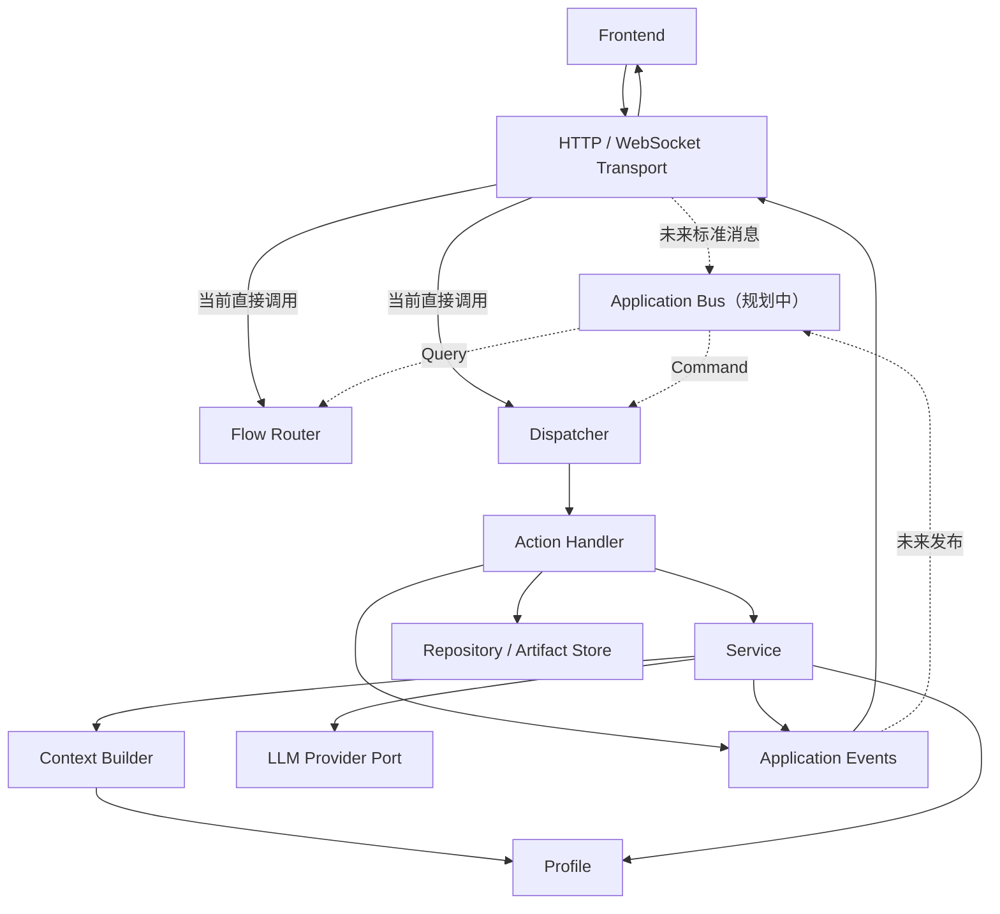

# 后端解耦分层与演进方向

本文面向维护 `superhp_agent` 源码的开发者，记录当前后端的职责边界、目标依赖方向和渐进重构顺序。已有功能、接口与模块细节见项目级 [`BACKEND_OVERVIEW.md`](../../BACKEND_OVERVIEW.md)；本文重点回答“代码应该属于哪一层”和“后续怎样重构而不破坏现有行为”。

## 当前定位

当前后端是一个确定性的 guided reading runtime，而不是自主循环式 Agent：

```text
接收前端消息
    → 读取阅读状态
    → Flow Router 生成 Cards
    → 用户选择 Action
    → Dispatcher 找到 Handler
    → Handler 调用 Service / Storage
    → 发出进度和结果事件
    → 重新生成 Cards
```

LLM 负责译注和查词，不负责自主规划阅读主流程，也不直接取得无限工具执行权限。选书扩展已经在
`agents/book_recommendation.py` 建立一个独立、有限工具和有限轮次的 Agent Loop；它不改变现有
guided reading runtime 的确定性 Action 边界。

## 核心设计原则

- Transport 处理协议，不承载业务决策。
- Bus 负责消息中转，不承载业务实现；目前只保留规划边界，暂不实例化。
- Flow Router 决定“展示什么选择”。
- Dispatcher 决定“把 Action 交给哪个 Handler”。
- Handler 决定“这项动作怎样完成”。
- Service 定义模型业务任务。
- Agent Tool 把模型可用的窄参数转换为应用调用，不承载业务规则。
- Agent Loop 在明确预算内协调模型决策和允许的工具。
- Context Builder 只构造当前模型任务所需上下文。
- Profile 定义文本场景策略。
- Provider 封装模型 SDK、协议和重试。
- Contracts 定义模块之间交换的数据。
- Storage / Repository 定义数据如何读取和持久化。
- Composition Root 是唯一允许了解全部具体实现的地方。

## 术语与职责边界

### Transport Router

当前对应 `main.py` 中的 HTTP endpoints 和 `transport/reading_ws.py`。

负责：

- 接收 HTTP / WebSocket 请求。
- 校验 JSON 和 Pydantic DTO。
- 管理连接生命周期。
- 将 Transport DTO 转换为标准 Query / Command。
- 把后端 Event 转换为 HTTP response 或 WebSocket message。

不负责：

- 决定 Cards。
- 执行 Action。
- 调用 Provider。
- 访问文件和数据库完成业务动作。

### Application Bus（规划边界，暂不实例化）

Bus 是后端应用消息的统一入口和中转站。目标职责是：

- 将 Query 交给对应 Query Handler 或 Flow Router。
- 将 Command / Action 交给 Dispatcher。
- 将 Application Event 转交给 Transport、日志、审计或未来订阅者。
- 隔离 Transport 协议与应用层入口。

Bus 不负责：

- 根据阅读状态生成 Cards。
- 实现 Action Handler。
- 调用 LLM。
- 保存业务数据。
- 拼接 Prompt。

当前 `ReadingSocketSession` 暂时承担了一部分消息中转职责。只有当 Contracts 稳定、入口或事件消费者增多时，才考虑实现 Bus，避免先创建仅根据字符串做 `if/else` 的空壳。

### Flow Router

当前对应 `runtime/action_router.py` 中的 `ReadingFlowRouter`。

负责：

- 读取 `ReadingUnitState`。
- 根据 phase 和当前状态选择 Cards。
- 保持阅读流程确定性。

不负责：

- 接收 WebSocket。
- 执行 Card Action。
- 写入阅读进度或其他 Repository。
- 调用模型。

### Dispatcher 与 Handler

当前位于 `runtime/action_dispatcher.py`。

Dispatcher 负责：

- 根据 Action ID 找到 Handler。
- 对未知 Action 返回统一错误。
- 调用 Handler。

Handler 负责：

- 校验本 Action 需要的 payload。
- 组合 Corpus、Service、Repository、Artifact Store 等能力。
- 更新应用状态。
- 发出 Application Event。

Dispatcher 本身不应继续承载译注文件路径、Markdown 序列化、API DTO 组装等具体职责。

### Service

当前对应 `services/annotator.py`、`services/lookup.py` 和
`services/recommendation.py`。
Service 的局部职责、译注校验和降级流程见 [`services/README.md`](services/README.md)。

Service 负责一个明确的后端业务能力，例如：

- 文本分块和并发译注。
- 模型结果校验、原文降级、合并与解析。
- 上下文查词和 JSON 修复。
- 按明确条件过滤和排序推荐候选。

Service 可以依赖 Profile、Context 和 Provider Port，但不应依赖 FastAPI、WebSocket、具体 SQLite 实现或页面流程。

### Agent Tool / ToolRegistry

当前由 `agent_tools/book_catalog.py` 建立第一条边界。Agent Tool 负责把模型容易调用的
JSON 基础类型转换为 Contracts，并把 Service 结果序列化为结构化证据。它不直接访问 SQLite、
不调用外部书目网站，也不自行放宽用户要求。

```text
Agent
    → ToolRegistry（注册、描述、allowlist 与执行）
    → BookCatalogSearchTool（模型工具边界）
    → RecommendationCandidateService（严格匹配与排序）
    → BookDifficultyCatalog（内部 Port）
    → SQLiteBookDifficultyCatalog（Storage Adapter）
```

`ToolRegistry` 是显式、小型的能力表，不扫描插件，也不因为工具已注册就自动授权给所有 Agent。
当前选书 Agent 只允许调用本地目录检索和无副作用的推荐提交工具；以后可以按 Agent 单独加入
合法的联网书目查询或受控文件编辑工具，不把业务规则重新复制到模型工具函数中。

### Book Recommendation Agent

`agents/book_recommendation.py` 实现选书场景专用的 Observe → Decide → Act 循环。它不是控制
阅读主流程的通用 Planner。

```text
RecommendationAgentSession
    → RecommendationAgentObservation
    → RecommendationContextBuilder
    → LLMProvider（system prompt + messages + tools）
    ├── 普通 Assistant 文本 → 暂停并等待用户
    └── 原生 Tool Call
            → ToolRegistry
            → Tool Result 写回消息历史
            → 下一轮 Provider
```

循环可以暂停为 `awaiting_user`。Application 层的 `RecommendationAgentRunner` 把完整 Session
交给 `RecommendationSessionRepository` 保存；收到下一条用户消息后按 `session_id` 加载相同
状态再继续。`search_local_book_catalog` 负责检索，`present_book_recommendations` 负责提交
1～3 本最终候选并终止 Loop。模型只能提交目录工具已经返回过的稳定 id。工具调用、单次候选数
和每次运行的模型轮数均有硬性预算，越界、无效参数和未知候选会作为 Tool Result 返回模型修正。

Loop 直接复用已有 `LLMProvider`，没有再增加一层功能重复的 Model Port，也不再要求模型把普通
对话包装成自定义 Decision JSON。专用 `RecommendationContextBuilder` 组织固定规则、运行时事实
和真实 user / assistant / tool 消息；Provider 统一负责 SDK、模型配置、原生 Tool Call 解析和
retry。

```text
Recommendation HTTP Router
    → RecommendationAgentRunner
        → RecommendationSessionRepository
        → BookRecommendationAgent
        → 保存更新后的 Session
```

Loop 不依赖 Storage，Repository 也不调用模型；Runner 只是围绕一次 Agent 运行组织加载与保存。

### Context Builder

当前由 `context.py`、Profile 的 context 构造方法和 `AnnotatorService` 共同实现。

负责：

- 将稳定规则组织为 system blocks。
- 将 Density、已掌握词等任务状态组织为运行时 blocks。
- 为每个 chunk 追加 reader text。
- 输出模型 messages。

模型 Context 不等于完整应用状态。书签、页面位置等与当前模型任务无关的数据不应进入 Context。

### Profile

当前位于 `profiles/`，通过 `ProfileRegistry` 注册。

本项目的产品与架构主路径是英文小说阅读。Profile 是迁移扩展点，用于证明 AnnotatorService、
Provider、Context、校验和降级框架可以迁移到其他文本场景；它不是要求所有场景对称实现的统一
模板。英文 Profile 可以围绕核心阅读体验持续深化，其他 Profile 只需满足最小协议并保持可运行，
不应为了形式统一反向限制英文主路径的设计。

Profile 是文本场景策略插件，负责：

- Prompt 和 Context policy。
- Annotation marker 解析。
- Lookup policy。
- POS / 学习标签规则。
- Card copy。
- 前端 renderer hint。

Profile 不负责调用 Provider、访问数据库、保存文件、发送 WebSocket 或执行 Action。

### Domain Rules

纯领域规则位于 `domain/`，可以同时被 Service 与 Infrastructure 使用，但不依赖两者。
当前 `domain/vocabulary.py` 负责合法词性集合、英文简写映射和未知词性回退；它不解析模型响应、
访问 SQLite 或构造 API DTO。调用方统一从 `domain.vocabulary` 导入该规则。

### Provider

具体实现位于 `providers/`；应用层接口位于 `ports/llm.py`，厂商无关响应位于
`contracts/llm.py`。

Provider 是模型基础设施适配器，负责：

- 封装厂商 SDK 或 OpenAI-compatible 协议。
- 统一模型请求和响应。
- 重试、错误归一化和 provider 元数据。

Provider 回答“怎样调用模型”；Service 回答“为了完成业务任务，模型应怎样被使用”。
Service 只依赖最小 `LLMProvider` Protocol。`BaseLLMProvider` 负责 generation 默认值和重试，
OpenAI-compatible Adapter 继承该实现基类。

### Contracts

Contracts 定义模块之间交换的数据，不负责保存数据或执行行为。目标上区分：

```text
contracts/
├── actions.py        # 前端可选择的标准动作
├── annotation.py     # 标注结果、chunk outcome 与降级问题
├── events.py         # 已经发生的事实
├── llm.py            # Provider 返回结果
└── reading.py        # 阅读单元与卡片
```

语义约定：

- Command 使用祈使语义，例如 `GenerateAnnotation`。
- Query 使用读取语义，例如 `GetReadingCards`。
- Event 使用过去式语义，例如 `AnnotationCompleted`。
- Transport DTO 只描述边界 JSON，不应成为 Runtime 的内部模型。

目前 `AgentAction` 已迁入 `contracts/actions.py`；`ReadingUnitMeta`、`ReadingUnitDetail` 和
`AgentCard` 已迁入 `contracts/reading.py`。Transport、Runtime 与 Composition Root 直接依赖
新 Contract；`schemas.py` 只保留 HTTP adapter 自己的请求和响应 DTO。
`BackendEvent` 位于 `contracts/events.py`，事件输出能力由 `ports/events.py` 中的
`EventSink` 定义。前端 reading.v1 扁平 JSON
由 `transport/event_mapper.py` 转换，Application Event 不再了解 WebSocket 格式。
`AnnotationResult`、`AnnotationChunkOutcome`、`AnnotationItem` 和 `ServiceIssue` 位于
`contracts/annotation.py`；Provider 与内容校验失败以稳定的 `category/code` 传递，不依赖异常文案。

### State / Read Model

当前 `runtime/reading_state.py` 中的 `ReadingStateReader` 聚合：

- Corpus 中的阅读单元。
- `ReadingProgressRepository` 中的已读和当前状态。
- `ReadingDifficultyMonitor` 只读聚合已完成英文单元与主动查词事实，输出长期观察状态。
- `ReadingAdaptationPolicy` 根据成熟窗口的未覆盖查词密度输出保持、升高、降低或难度告警决策；
  当前是纯规则层，尚未接入自动执行。
- DB 中的词汇统计。
- Annotated artifact 是否存在。

它通过 `artifacts/annotated_copies.py` 中的 `AnnotatedCopyStore` 查询译注产物，
是只读聚合器，不应写入进度、生成文件或反向依赖 Dispatcher。

### Ports 与 Storage

`ports/` 和 `storage/` 分别回答两个不同问题：

```text
ports/                         # 上层业务需要哪些底层能力
├── llm.py                     # 模型调用能力接口
├── events.py                  # 事件发布与行为记录能力接口
├── book_catalog.py            # 选书目录查询能力接口
├── recommendation_agent.py    # 选书 Agent 的单步模型决策接口
└── repositories/              # 可查询、可更新的数据能力接口
    ├── vocabulary.py
    ├── bookmarks.py
    ├── reading_progress.py
    ├── reading_support.py      # 每本书的英文译注支持目标
    └── chapter_checkpoints.py  # 完整章节阅读快照

storage/                       # 存储类 Port 如何具体实现
├── database.py                # SQLite 连接、锁和生命周期
├── migrations.py              # schema 创建与旧数据升级
├── app_db.py                  # 过渡期组合与兼容门面
└── sqlite/                    # Repository 的 SQLite Adapter
    ├── units.py
    ├── vocabulary.py
    ├── bookmarks.py
    ├── reading_progress.py
    ├── reading_support.py
    └── chapter_checkpoints.py
```

Port 只声明方法、参数和返回值，不执行 SQL，也不知道数据文件的位置。Runtime、Service 和
Transport 依赖 Port，从而只表达“需要什么能力”。`storage/` 中的 Adapter 依赖并实现这些
Port，负责 SQLite、事务、锁、表结构和迁移，从而表达“能力怎样落地”。

以书签为例：

```text
HTTP Handler
    → BookmarkRepository（ports 中的能力边界）
    → SQLiteBookmarkRepository（storage 中的具体实现）
    → backend/data/superhp.sqlite3（实际运行数据）
```

因此，`ports/` 可以类比为后端内部的“所需能力清单”，但不同于直接暴露给 Agent 的 ToolList；
`storage/` 则只实现其中与持久化有关的一组能力。具体实现只应由 Composition Root 选择并注入，
业务层不应直接构造 SQLite Repository。

当前选书能力进一步证明了这个区别：Agent 看到的是
`agent_tools.BookCatalogSearchTool`，而不是 `ports.BookDifficultyCatalog`；前者使用
JSON 友好的窄输入，后者是 Service 与 Adapter 之间的内部能力接口。

### Storage / Repository / Artifact Store

各类数据的唯一真相来源、目标表结构和渐进迁移顺序见
[`storage/README.md`](storage/README.md)。下文描述当前已经落地的代码边界。

数据按性质分为四类，不合并成一个万能 StorageManager：

```text
storage/
├── __init__.py            # 导出 SQLite 组合入口 AppDB
├── app_db.py              # 组合各 SQLite Repository 的生命周期门面
├── database.py            # SQLite 连接、锁与关闭
├── migrations.py          # schema 初始化和增量升级
└── sqlite/                # Repository 的 SQLite 实现
    ├── units.py           # 内部 unit metadata 同步
    ├── vocabulary.py      # 已完成：词汇 SQL 实现
    ├── bookmarks.py       # 已完成：书签 SQL 实现
    ├── reading_progress.py # 已完成：阅读进度 SQL 实现
    ├── reading_support.py  # 已完成：每本书译注目标 SQL 实现
    └── chapter_checkpoints.py # 已完成：完整章节观察快照
```

- `CorpusStore`：扫描、解析并安全读取原始语料。
- `AnnotatedCopyStore`：命名、读取和保存每个阅读单元的唯一译注副本。
- `ReadingProgressRepository`：通过 SQLite 保存当前、已打开和已读状态。
- `ReadingSupportRepository`：按书保存当前英文译注支持目标；未设置时返回默认值 8。
- `ChapterReadingCheckpointRepository`：幂等保存完整章节首次读完时的词数、查词和实际支持目标。
- `EventLogStore`：只向 JSONL 追加诊断事件，不读取或重建业务状态。
- Repository：提供业务数据操作，不向上层暴露 SQL row 细节。

Runtime 当前通过 `ports/repositories/vocabulary.py` 中的最小 `VocabularyRepository` 使用
词汇能力；`SQLiteVocabularyRepository` 实现该 Port 并拥有全部词汇 SQL。`AppDB` 暂时保留
同名转发方法，使 HTTP 端和历史调用可以渐进迁移。

书签 HTTP 入口通过 `ports/repositories/bookmarks.py` 中的 `BookmarkRepository` 访问书签；
`SQLiteBookmarkRepository` 实现该 Port 并拥有全部书签 SQL，Composition Root 直接注入该实现。
`AppDB` 暂时保留同名转发方法兼容历史调用。

`CorpusStore`、`AnnotatedCopyStore` 和 `EventLogStore` 保持各自的数据生命周期，不因 SQLite
实现进入 `storage/` package 就统一改称 Repository。阅读进度则通过
`ReadingProgressRepository` 访问。上层依赖职责边界，不依赖最终文件布局。

Contract 回答“模块之间交换什么数据”；Repository 回答“数据如何保存和读取”。

### Composition Root

当前由 `application/container.py` 中的 `AppContainer` 和 `build_container()` 承担，负责：

- 读取 Settings。
- 创建 Stores、Repositories、Provider、Services、Profiles、Router 和 Dispatcher。
- 将具体实现注入 Transport。
- 管理共享数据库资源的关闭入口。

`main.py` 当前从 Container 取得一组兼容别名，供尚未拆出的 HTTP routes 使用。新增的
`transport/recommendation_http.py` 已采用 Router factory，显式接收 Runner 与 Catalog；
后续只有在其他路由产生实际变化压力时才继续迁移。其他模块不应反向导入 Composition Root
或依赖 `main.py` 中的全局单例。

## 当前消息流



## 目标依赖方向

允许的总体方向：

```text
Transport
    → Bus / Application Runtime
        → Domain Policies / Ports
            ← Infrastructure Implementations
```

具体规则：

- Transport 可以依赖 Contracts 和 Application 入口。
- Runtime 可以依赖 Domain、Service 和 Port Protocol。
- Service 可以依赖 Profile、Context 和 Provider/Event Port。
- Infrastructure 实现 Port，但业务层不应依赖具体基础设施类。
- Domain / Profile 不依赖 Transport、FastAPI、SQLite 或具体 Provider。
- Read Model 不依赖 Dispatcher。
- Service 不依赖 Storage 中的工具函数。

## 已知边界问题

已解决：

- `ReadingStateReader` 和 Action Handlers 现在共同依赖 `AnnotatedCopyStore`，已消除
  `ReadingStateReader → ActionDispatcher` 的反向依赖。
- `AnnotatorService` 现在依赖 `ports.events.EventSink`，已消除
  `AnnotatorService → runtime.events` 的反向依赖。
- `WordLookupService` 和 Storage 现在共同依赖 `domain.vocabulary.normalize_pos`，已消除
  `WordLookupService → storage` 的反向依赖。
- Action Handler、Read Model 与 WebSocket Session 现在依赖 `VocabularyRepository`，不再直接
  依赖具体 `AppDB`。
- 书签 HTTP 入口现在依赖 `BookmarkRepository`，不再直接调用全能型数据库对象。
- SQLite connection、migration、unit metadata、Vocabulary 与 Bookmark SQL 已完全分离；
  `AppDB` 只保留组合、关闭连接和旧方法转发。
- `BackendEvent` 已成为纯 Application Contract，reading.v1 JSON 映射归属 Transport。

以下两个大文件继续以实际变化压力为准，不为了缩短行数而拆分：

1. `action_dispatcher.py` 仍同时负责分发、Handlers 和 API DTO 组装，职责偏多。
2. `main.py` 仍承担大多数旧 HTTP routes 和 DTO mapper；推荐对话路由已经独立。

## 渐进重构路线

### 阶段 1：AnnotatedCopyStore（已完成）

- 新建独立译注副本存储模块。
- 移出路径解析、Legacy 回退、存在性判断、读取、写入和 Markdown 序列化。
- 让 `ReadingStateReader` 与 Action Handlers 同时依赖该 Store。
- 消除 `ReadingStateReader → ActionDispatcher`。

外部 API、WebSocket 事件和文件格式保持不变。

实现位于 `artifacts/annotated_copies.py`；Composition Root 创建同一个 Store，并注入
`ReadingStateReader`、WebSocket Session 和 Action Context。旧的目录参数仍作为兼容入口，便于现有测试和调用方渐进迁移。

### 阶段 2：最小 Contracts（已完成）

- 已完成第一刀：抽出 `contracts/actions.py` 中的 `AgentAction`。
- 已完成第二刀：抽出 `contracts/reading.py` 中的阅读单元和 Card 只读模型。
- 已完成第三刀：抽出 `contracts/events.py` 中的 `BackendEvent`。
- 已完成第四刀：抽出 `contracts/llm.py` 中厂商无关的 `LLMResponse`。
- 已将 reading.v1 Event JSON 映射移到 Transport，WebSocket 消息保持不变。
- 已移除 `schemas.py` 中的 Contract 兼容 re-export，跨层模型统一从 `contracts/` 导入。
- 当前最小范围已区分 Action、Reading、Event、LLM Contract 与 Transport mapping。

### 阶段 3：通用 Ports（已完成）

- 已将 EventSink 移到 `ports/events.py`，Service 不再依赖 Runtime 事件模块。
- 已在 `ports/llm.py` 建立最小 LLMProvider Protocol，Service 不再依赖 Provider 实现包。
- 已将 POS 规范化提取为 Vocabulary Domain Rule，Service 不再依赖 Storage 工具函数。
- 已建立最小 VocabularyRepository Protocol，Action Handler、Read Model 与 WebSocket Session
  不再依赖具体 `AppDB`。
- 已建立独立 BookmarkRepository Protocol，没有扩张 Vocabulary 接口。

### 阶段 4：Storage Package（已完成）

- 已先稳定 Vocabulary 与 Bookmark Repository 的上层访问边界，SQLite 实现暂留 `AppDB`。
- 已将 `storage.py` 转成 package，并通过 `storage/__init__.py` 保持旧 import。
- 已拆出 `SQLiteDatabase` connection boundary 和独立 migrations 模块。
- 已拆出 `SQLiteVocabularyRepository`，`AppDB` 保留旧方法转发。
- 已拆出 `SQLiteBookmarkRepository`，Composition Root 直接注入该实现。
- 已拆出内部 `SQLiteUnitRepository`，供两个业务 Repository 共享 metadata 同步。
- `AppDB` 现在只保留组合、连接生命周期和兼容转发，不再包含 SQL。
- Corpus、Event Log、Annotated Copy 保持不同的数据生命周期。

### 阶段 5：Composition Root（已完成）

- 已新建 `AppContainer`，对象创建顺序移出 `main.py`。
- 已将 `LazyLookupService` 移到独立 Service，并通过 provider factory 注入。
- `main.py` 暂时保留 Container capability aliases，维持现有 routes 和测试兼容。

当前只为新增的推荐对话建立独立 HTTP Router，不为了结构统一批量搬迁稳定的旧路由，也不实例化
Bus 或 Planner。选书 Agent 只使用显式注册和 allowlist 的轻量 ToolRegistry；插件扫描、自动
发现和通用工具生态仍等到真实需求增长后再评估。

## 每一步的完成标准

一次重构只有同时满足以下条件才算完成：

- 外部 HTTP / WebSocket Contract 不变，或有明确兼容层。
- 依赖方向比修改前更清晰，没有新增反向 import。
- 新模块在文件开头说明负责什么、依赖什么、不负责什么。
- 原有测试通过，并为新边界补充针对性测试。
- Ruff 通过。
- Git diff 能被理解为单一职责变更，可独立回退。

常规验证命令：

```powershell
cd backend
uv run python -m pytest
uv run ruff check .
```

## 当前明确不做

- 暂不实例化 Application Bus。
- 暂不引入自主规划式 Agent Loop。
- 暂不一次性迁移全部目录到完整 DDD 结构。
- 暂不让 LLM 直接决定并执行任意工具调用。
- 暂不重命名仍具有产品语义的 chapter Action id 与事件类型；标识字段已经统一为 `unit_id`。

先修正依赖方向和职责所有权，再自然移动目录；不要为了形式上的分层制造空壳抽象。
