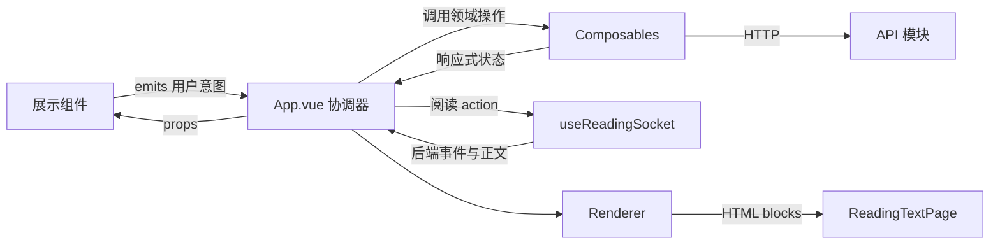

# 前端解耦与分层说明

本文说明 `frontend/src/` 当前的职责边界、数据流和扩展约定。接口协议与产品行为详见上一级的 `FRONTEND_INTEGRATION.md`；这里重点解释代码应该放在哪里，以及各层之间如何协作。

## 设计目标

前端采用“单向数据流 + 页面协调器 + 领域 composable + 展示组件”的结构：

- API 模块只处理 HTTP 请求和错误转换。
- Composable 持有一个领域的状态与业务操作。
- 展示组件通过 props 接收数据，通过 emits 表达用户意图。
- `App.vue` 只协调跨领域流程，不重新实现各领域内部逻辑。
- Renderer 负责把不同 profile 的正文转换为可渲染块，不参与网络请求或页面导航。

拆分的目标不是追求最少行数，而是让每项状态只有一个所有者，让依赖方向保持清晰。

## 目录结构

```text
src/
├── main.js                         # Vue 应用入口
├── App.vue                         # 页面协调器与阅读流程组合根
├── api/                            # HTTP API 边界
├── composables/                    # 可复用的领域状态和行为
│   ├── useAnnotationDensity.js     # Density 选择、持久化、level 映射
│   ├── useBookmarks.js             # 书签 CRUD、分组和跳页解析
│   ├── useReaderPagination.js      # CSS columns 分页和 DOM 测量
│   ├── useReadingCatalog.js        # Profile、章节目录和选择持久化
│   ├── useReadingSocket.js         # WebSocket 会话和后端事件状态
│   └── useWordLookup.js            # 查词、上下文提取和手动标注
├── components/
│   ├── VocabularyPanel.vue         # 生词列表功能区
│   └── reading/                    # 阅读器展示组件
│       ├── GuidancePanel.vue       # Guided cards 与 action 选择
│       ├── LookupPopover.vue       # 查词结果浮层
│       ├── ReaderStatePage.vue     # 生成、错误和空状态
│       ├── ReadingPaperFooter.vue  # 正文模式、书签按钮和页码
│       ├── ReadingSidebar.vue      # Profile、章节和书签目录
│       ├── ReadingTextPage.vue     # 正文块与分页 DOM 节点
│       └── ReadingTopbar.vue       # 顶栏、视图切换和 Density 菜单
├── renderers/                      # Profile-specific 正文解析和 HTML 渲染
├── styles/                         # 分区样式
├── styles.css                      # 全局样式入口
└── utils/                          # 无状态通用辅助函数
```

## 分层职责

### 1. API 边界：`api/`

每个文件对应一类 HTTP 资源，例如章节、书签、查词和生词。该层负责：

- 组装 URL、query 和 JSON body。
- 调用 `fetch`。
- 把非成功响应转换为可读的 `Error`。
- 返回后端 JSON，不持有 Vue 响应式状态。

API 文件不能操作 DOM、`localStorage`、路由视图或其他 composable。

### 2. 领域状态：`composables/`

一个 composable 应当只有一个明确状态域。例如 `useBookmarks` 可以保存和删除书签，但不能决定 WebSocket 应发送哪个阅读 action；后者需要同时了解当前 Density 和阅读会话，属于 `App.vue` 的协调职责。

Composable 可以依赖：

- Vue 响应式原语。
- 对应的 API 模块。
- 调用方显式传入的 getter 或回调。

Composable 不应直接导入展示组件，也不应通过查询全局 DOM 与其他模块建立隐式联系。

### 3. 展示层：`components/`

阅读组件遵循“props 向下、events 向上”：

- props 是已经准备好的显示数据。
- emits 表示用户做了什么，例如 `select-chapter`、`save-bookmark` 或 `action`。
- 组件可以持有纯 UI 临时状态，例如 Density 菜单是否展开。
- 组件不能自行决定跨领域流程或直接修改父级状态。

纯格式化逻辑应放在最接近展示位置的组件中。例如章节编号、badge 文案和书签时间格式属于 `ReadingSidebar`，不属于书签持久化层。

### 4. Profile 渲染：`renderers/`

Renderer 将阅读正文拆成 block，并把 profile-specific 标记转换成 HTML。当前英文小说和文言文可以拥有不同渲染规则，但它们共享同一阅读壳、分页机制和交互协议。

Renderer 不负责：

- 获取正文。
- 保存生词。
- 切换章节。
- 计算纸面页数。

### 5. 页面协调器：`App.vue`

`App.vue` 是各层的组合根。它保留以下职责：

- 创建 composable 并连接它们的输入输出。
- 根据 WebSocket 状态推导 `readerMode`。
- 处理跨领域动作，例如给 annotation action 补充 Density level。
- 切换 Profile 时同时清空章节、cards、分页和查词状态。
- 打开书签时协调 WebSocket action 与分页跳转。
- 组合侧栏、顶栏、纸面状态、正文、生词页等组件。

如果一段逻辑只依赖一个领域，就应优先下沉到对应 composable；如果只是渲染 props，就应优先进入展示组件。

## 核心数据流



典型例子：用户在查词浮层中点击“添加标注”。

1. `LookupPopover` 发出 `add`。
2. `App.vue` 调用 `useWordLookup.addLookupAnnotation()`。
3. `useWordLookup` 通过 vocabulary API 保存词条，并更新手动标注状态。
4. `App.vue` 刷新目录统计。
5. Renderer 根据新标注重新生成 blocks。
6. `useReaderPagination` 重新计算页数。

## 分页 DOM 边界

分页是当前最需要保持明确的特殊边界：

- `ReadingTextPage` 持有真实的 `.reading-viewport` 和 `.reading-flow` DOM。
- 组件通过 `elements-change` 显式注册或注销这两个元素。
- `App.vue` 把元素写入 `useReaderPagination` 暴露的 refs。
- `useReaderPagination` 负责等待字体和渲染帧、设置 column 宽度并计算页数。
- `ReadingTextPage` 不计算页数，分页 composable 也不查找全局 DOM。

不要改用 `document.querySelector()` 或跨组件私有 `$refs`，否则组件挂载时序和多实例场景会变得不可控。

## 文件头注释约定

新拆出的组件和 composable 必须在文件开头用简短注释回答三件事：

1. 它负责什么。
2. 它依赖调用方提供什么。
3. 它明确不负责什么。

Composable 示例：

```js
/**
 * Owns ... state and operations.
 * The page coordinator supplies ...
 * This composable does not ...
 */
```

Vue 展示组件示例：

```html
<!--
  Presents ... and emits user intent only.
  State and side effects are owned by ...
-->
```

注释用于记录边界，不重复逐行解释实现。

## 扩展规则

新增功能时按以下顺序判断放置位置：

1. 只是请求后端：放入 `api/`。
2. 拥有一组相关状态和操作：创建或扩展 composable。
3. 只是展示数据并收集点击：创建展示组件。
4. 只与某种文本 profile 的标记格式有关：放入 renderer。
5. 同时连接两个以上领域：由 `App.vue` 编排。

应避免：

- 在展示组件中直接调用 API。
- 在多个文件中分别持有同一份业务状态。
- 为减少文件行数而创建只有透传作用的组件。
- 让 composable 直接切换页面视图或发送不属于其领域的 WebSocket action。
- 把 Profile-specific 判断重新散落到阅读壳中。

## 验证

每次调整分层或组件边界后至少运行：

```powershell
cd frontend
npm run build
```

涉及分页 DOM 时，还应手动检查：原文与译注分页、窗口缩放、左右键/空格翻页、末页 guidance、书签恢复和点击查词。
